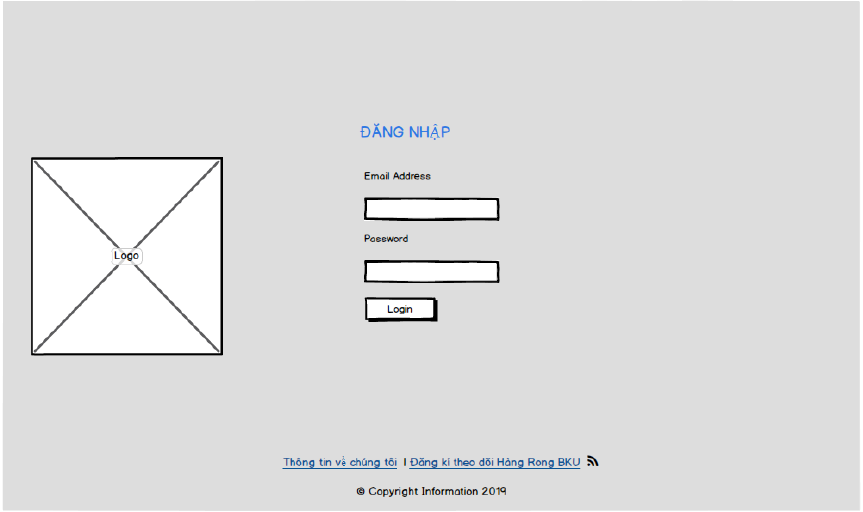
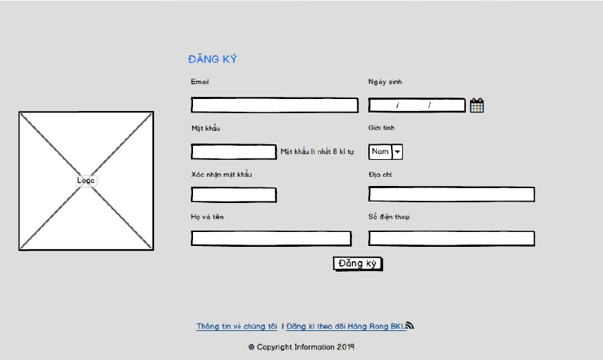
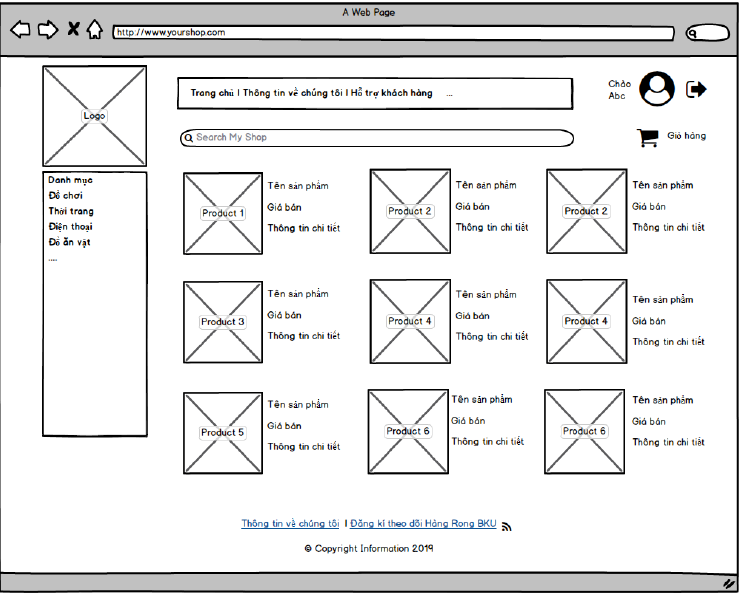
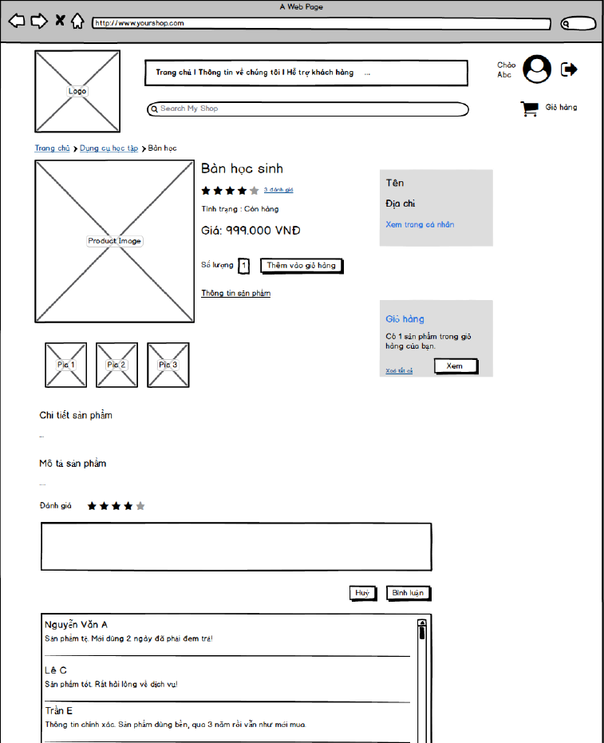
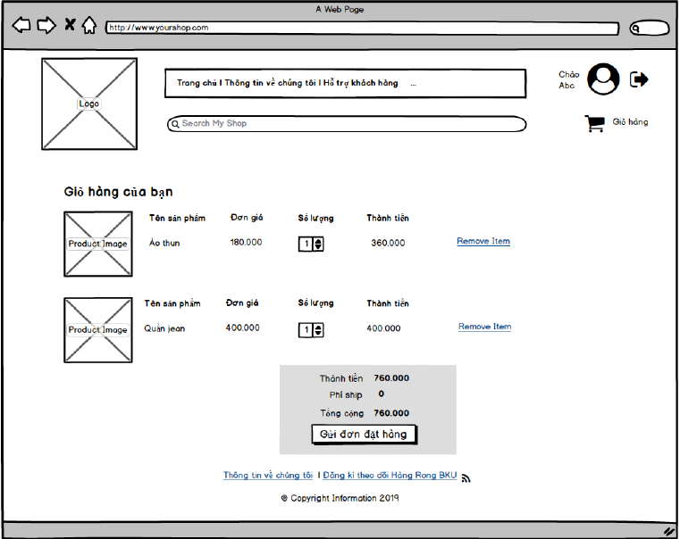
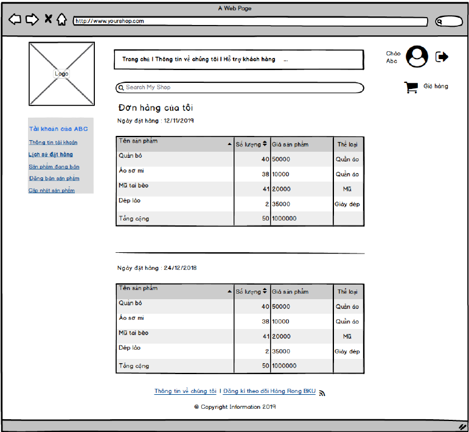
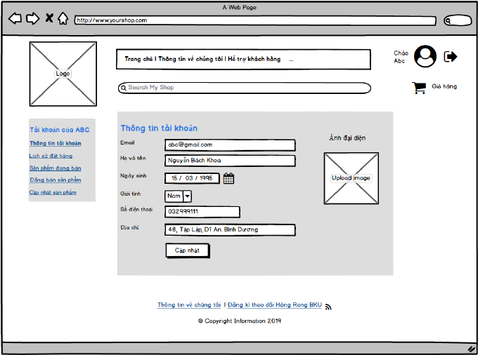
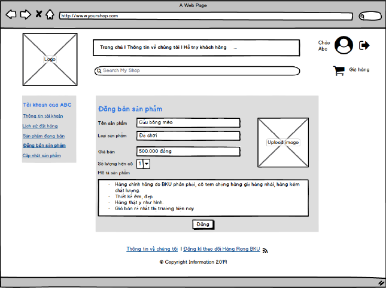
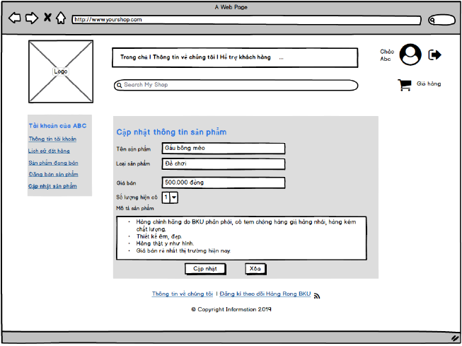
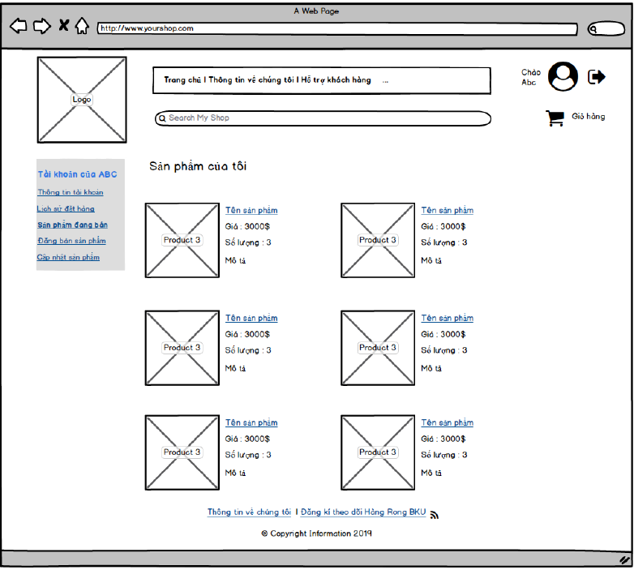

# Hàng Rong BKU

> Website trao đổi, mua bán hàng hóa dựa trên nền tảng laravel

## Giới thiệu

* Đồ án môn học: Thực tập công nghệ phần mềm của Trường ĐH Bách Khoa TP HCM.

* Thành viên thực hiện:

    Tên | MSSV
    --- |---
    Đặng Hoàng Ân | 1610132
    Lương Thiện Chí | 1610304
    Nguyễn Huỳnh Thoại | 1613379
    Nguyễn Việt Hưng | 1611441
    Võ Khắc Trí | 1613754

## Tính năng

* Đăng kí tài khoản, đăng nhập
* Xem danh sách các mặt hàng mà mọi người đăng bán
* Lọc mặt hàng theo từ khóa, giá cả
* Chọn các mặt hàng để xem thông tin chi tiết liên quan tới mặt hàng
* Xem các bình luận, đánh giá về mặt hàng
* Thêm mặt hàng vào giỏ hàng (kèm số lượng)
* Chốt mua các sản phẩm đã có trong giỏ hàng
* Bình luận, đánh giá mặt hàng
* Xem thông tin về lịch sử mua bán
* Đăng bán mặt hàng mới
* Xem và chỉnh sửa thông tin cá nhân
* Quản lý danh sách các mặt hàng đang bán, tùy chỉnh.
* Đăng xuất

## Mockup

Mockup giao diện website

**Đăng nhập**

    

**Đăng kí tài khoản**

    

**Trang chủ**

    

**Trang chi tiết mặt hàng**

    

**Trang giỏ hàng**

    

**Trang lịch sử đặt hàng**

    

**Trang thông tin cá nhân**

    

**Trang đăng bán mặt hàng**

    

**Trang cập nhật mặt hàng**

    

**Trang quản lý mặt hàng đang bán**

    

